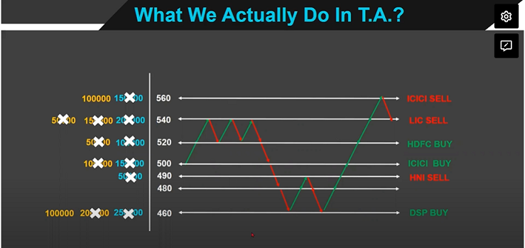
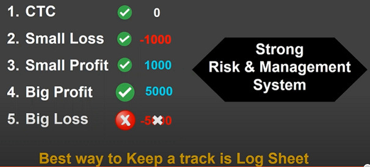

# Day 1. Novice

About Workshop
-----------------------

About Trainer
-----------------------

How stock market works?
-----------------------

1. In Normal Business, we have one sellet and lots of buyers. But in stock of market we have lot of sellers and lot of buyers.
2. Types of Traders (Investors)
    * FII - Foreign Instututional Investors
    * DII - Domestic Institutional Investors
        * Banks
        * Insurance
        * MF
        * FI
        * NBFC
        * HNI
        * Retailers
        >Always follow FII and DII to earn money in market

3. Market Hours 
Retailers - Monday to Friday from 9.15 to 3.30
Bulk/Block Deal - Seperate Window from 8.45 to 9.15

What we actually do in T.A.
---------------------------

Why Traders loose money in stock market
---------------------------
    * Expectations v/s Experience
    * Need
    * Training v/s Mentoring
        Training programmes (Information) 
        Need Mentoring (Knowledge of trading)
    * Big profit videos
    * Choosing a Wrong Trades

You will never make your account Zero
---------------------------
    * Risk and Money Management
    * Emotional control 
        If some stop losses get hit, emotional balance shakes.
        Do not decide trade emotionally
    * R:R Ration (Risk to Reward Ratio)

How to be always on Winning side.
---------------------------

