# Day 2. Advance Beginners

Basic of Charts
---------------
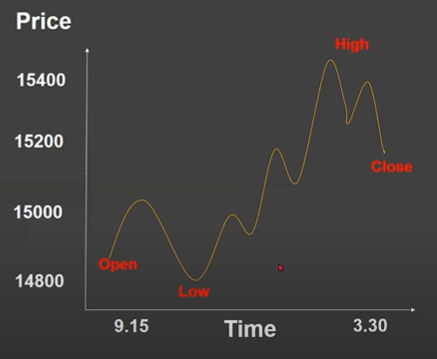

How to read Charts
---------------

Types of Charts
---------------
* Line Chart
* Bar Chart
* Candlestick Chart
* Hikenashi Chart
* Renko Chart
* Point & Figure Chart

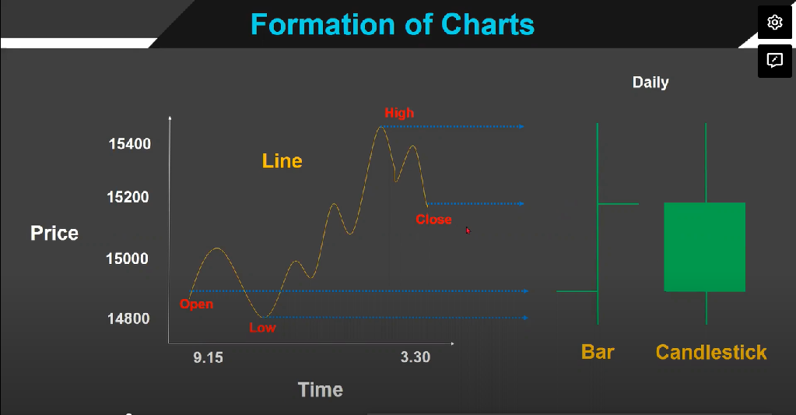

What is Price Action ?
---------------
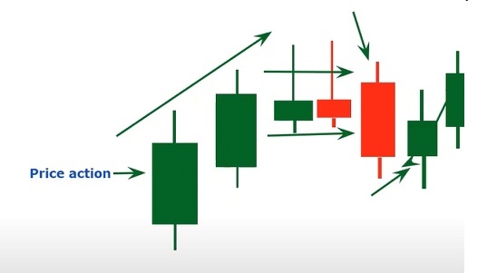

Trend Analysis
---------------
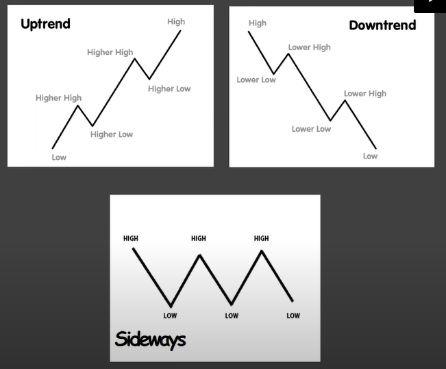

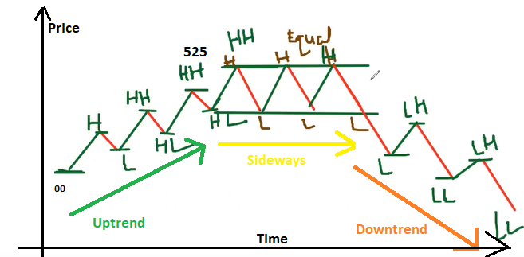

Some Imp Candlestick Patterns
---------------
## Harami (Pregnant)
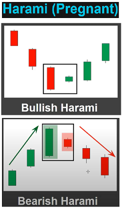

## Engulfing (Cover)
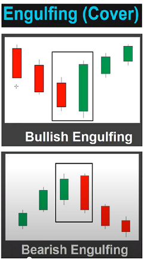

Some Imp Chart Patterns
---------------
## Channels (Chart Pattern)
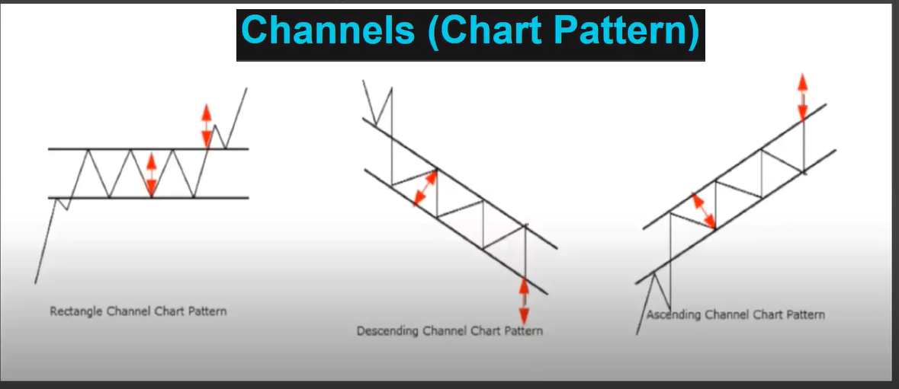

## Channels (Chart Pattern)
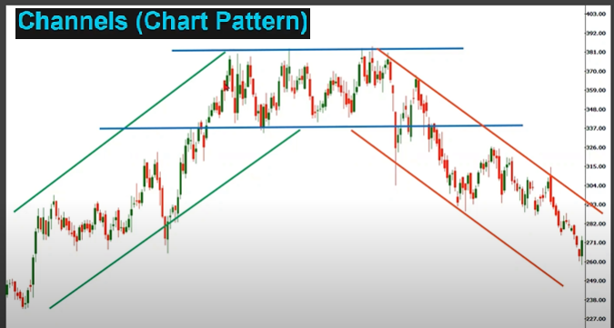

## Triangles (Chart Pattern)
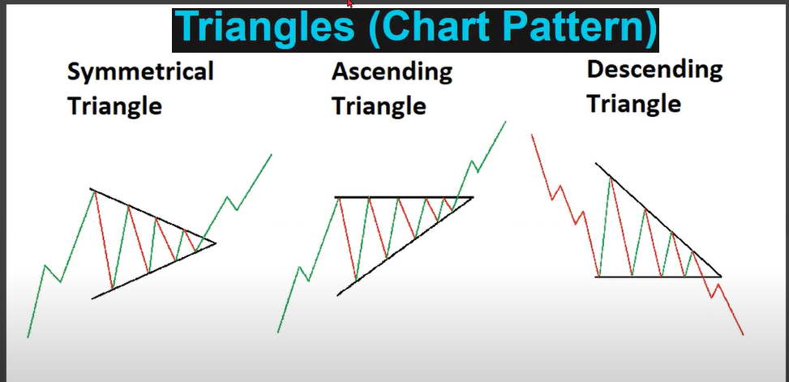

## Channels (Chart Pattern)
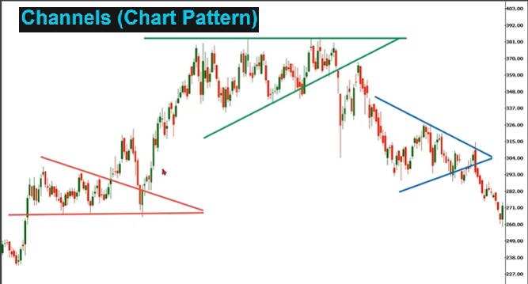

Support and Resistance
---------------

## Support & Resistance (Zones)
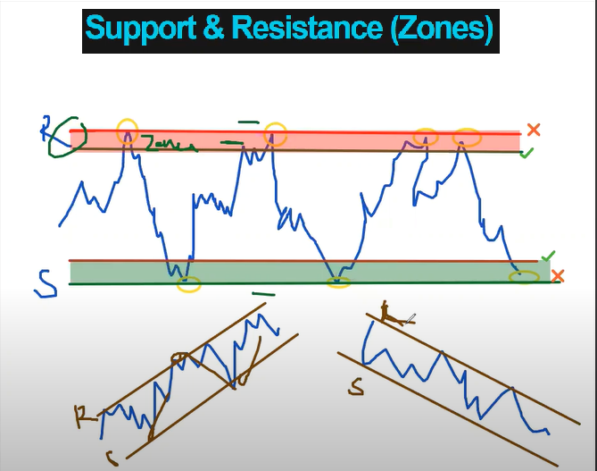

## Support & Resistance (Trendline)
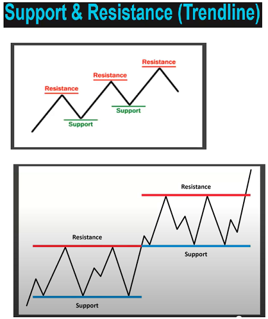

Phases of Market
---------------
* Trending-
    Trading with a Trend Carries a Higher Probability of Success.
* Sideways
* Volatile