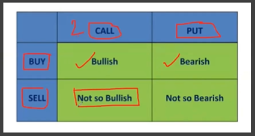
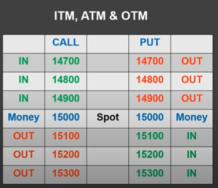
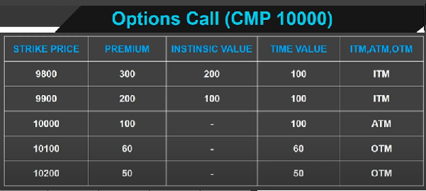
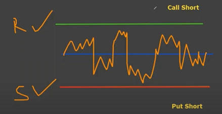
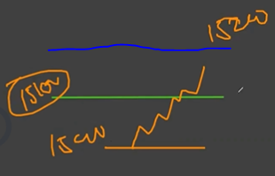
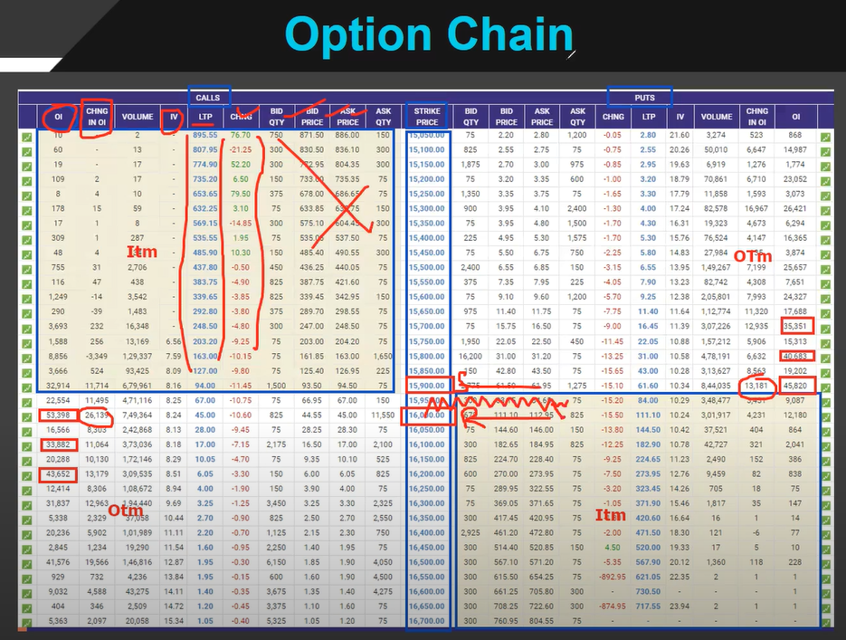

# Day 3. Proficient 

Equity
------

    A Wealth Creation Tool
    Most Popular Segment amongst Investor
    This is a Base (Futures & Options Depend on)
    Work at least 3 Months on it

    Features
    * Small Capital 
    * Small SL (Low Risk)
    * Helps in Build Emotions and Psychology
    * Improves Stablity (1st Step as a Professional)

Furtures
--------

    An Income Generation Tool (Virtual Contract)
    No Investor
    Most Popular Segment amongst Traders
    Work at least 3 months on it after 2 to 3 months on equity (Index futures)
    Features -
    * Huge Capital
    * High Rish / High Reward
    * Erode capital fast
    * Direct Futures, break Emotions and Psychology
    * Need lot of efforts to stablize.

Options
-------
    Feaures -
    * Most lucrative and popular amongst Traders
    * Only one reason Low Capital on buying side
    * Last stage of professional traders
    
Call Side 
    When market is in uptrend

Put Side 
    When market is in downtrend

2 Types of Traders
    Buyer (Holder of option)
    Seller (Writer of option)

    Buy = Call or Put
    Sell = Call or Put

Theoretically
    Market in uptrend
    We Buy a Call or Sell a Put

    Market in downtrend
    We Buy a Put or Sell a Call

## Practically 

Which Side is Better? Buyer or Seller

    Buying needs a premium
    Seller needs whole margin

    Sellers win at the end

### Spot Price (Nifty base price)
### Strike Price (Predecided by Exchange)
### ITM (In the Money), ATM(At the Money) & OTM (Out the Money)

## Premium
    Premum is the Price of an option

    Premium = Intrinsic value + Time Value
    e.g. 
    Nifty Call : 50 (Premium)
    Nifty Contract : 50
    Option Value : 50 * 50 = 2500

    Intrinsic Value 
        It is the amount by which option is in ITM. 
        ATM and OTM do not have intrinsic value.

    Time Value
        It is part of premium over and aboveits Intrinsic Value. 
        ATM and OTM only have Time Value.

## Short Call/ Short Put
    * Short Call : If Current price does not break resistance.
    * Short Put : Current price does not break support.
    * Both : Current price in between Support & resistance (moving sideways)

## Buy Call
    * Current price should be in uptrend.

## Option Chain

## How to Trade Options ?
    Good Technical Analysis is required.