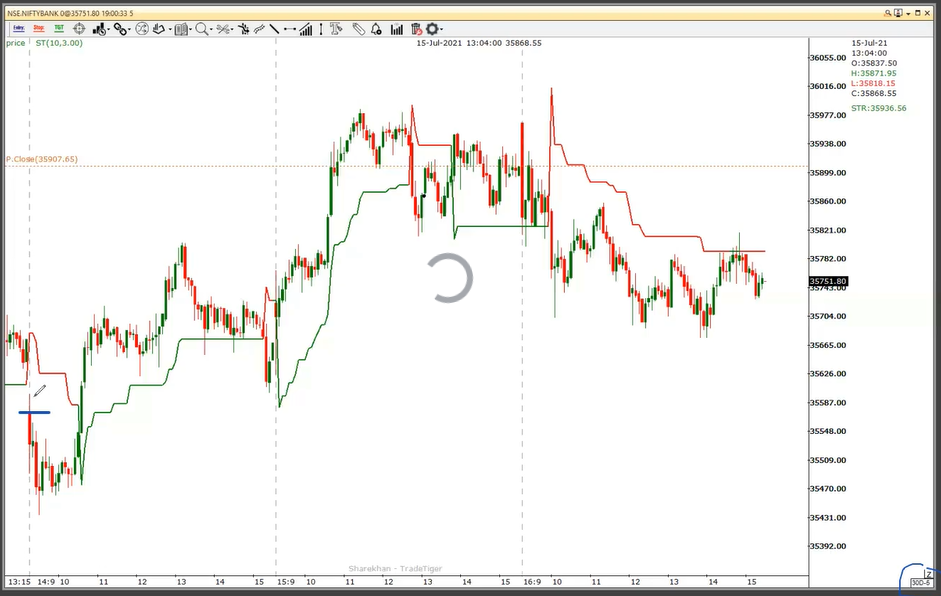

# Day 4. Expert

Techical Indicators
------------------

What is indicators?

Types of Indicators?
    - Leading 
    - Lagging

Indicators are necessary OR only Price action is enough ?

### Moving Averages
    Line derived from average of closing prices of fix days.

    Types of Averages
    * Simple
    * Exponential
    * Weighted

    Generally we use 2averages to decide Entry and Exit

### Moving Average Convergence Divergence

### RSI - Relative Strength Index
    Helps up to find overbrought and oversold stocks 
    Overbought above 70 or 80.
    Oversold below 30 or 20

### Supertrend

### Pivot Points
    Automatic important support & resistances

### Indicators in investing.com

Rismotion Indicators
--------------------

    A Professional Trader
    Risk and Money management
    Psychological & Emotional Balance
    

How to Start a trading Day
-------------------------
    Checkout SGX (Singapore Exchange) - 8.30AM
    Do Trading Analysis on Nifty, bank nifty index
    Scan Your Stocks (Chartink.com)
    Take out important levels
    Execute your plan as per those levels.
    Validate your Success
