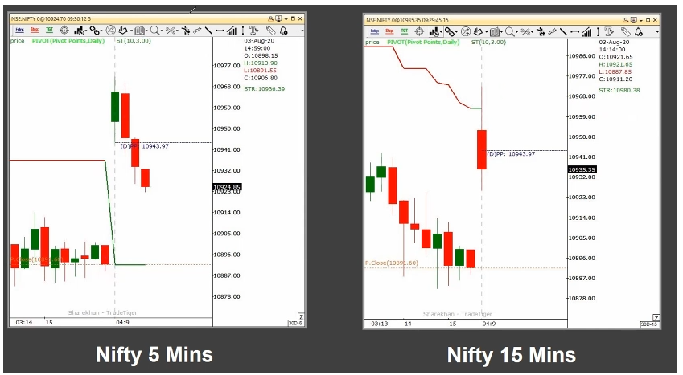

# Live Session

Setup & Rules
---------------
- Trade after 9.30 AM
(Not Much Gap up/ Gap Down)

- Candlestick Chart
	(5 Min/ 15 Min/ 30 Min)
	
- Supertrend (10,3)

- Exponential Moving Average
	(13 Ema, 21 Ema)
	
- Pivots Point

#### Why did second candle in 5mins chart was red ?
		From 5 mins chart there is no information for what reason 2nd candle became red.
		But in 15 mins chart we can see SuperTrend acting as resistance, which caused the candle to become red.

#### MA crossover is acting as support and price is moving up.

* In Below Snap, 
	For 5 mins Setup: It seems Ideal to take trade.
	But for 15 mins : Supertrend acts as a resistance, hence this trade is not perfect and should be avoided.	

* Overall

> Always make descision after the candle closes.

#### In below case 15 mins Super Trend is acting as resistance, hence we should not take trade.

#### 5min support, but 15 mins resistance

#### Buy Setup 1 (Allembic Pharma)
	First candle in 15 min chart is below Super Trend resistance, Second candle breaks the resistance of Super Trend. 
	MA Cross over is also observed during that time in both the Charts (5 & 15 mins).
	Hence this seems to be good buy trade.
	With Buy at 998, SL = 991 (After some time move SL along with Super Trend to avoid risk and book as much profit as possible)

#### Buy Setup 2 (Hexaware )
	Both the charts are already aligned. 

Indusind Bank, Bajaj Finance, Jubilant Food (Good stocks for Intraday). These are high beta stocks (have high momentum).

#### Buy Setup 3 (Indusind bank )

#### Buy Setup 4 (Hexaware )

#### Buy Setup 5 (PEL )

#### Buy Setup 6

4 D's of Core Trading
----------------------

5% Trading Mastery
----------------------

