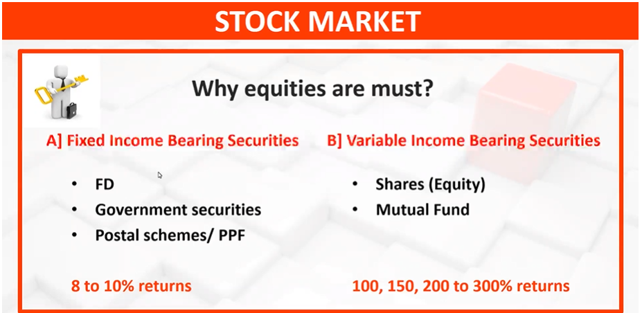
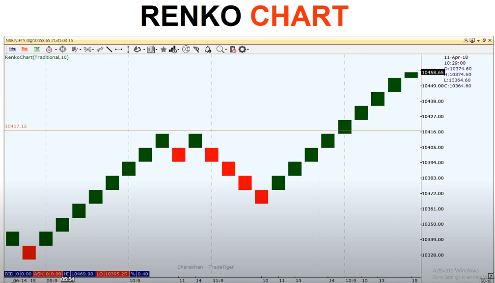

# Foundation 1
### Risk
    "Risk is the possibility of losing money invested"

### Me
#### My Risk Taking Capacity
    *   Personality
    *   Objectives
    *   Age
    *   Time period
    *   Income and Wealth
    *   No of Dependents
        - Risk taking capacity depends on no of dependents.
    
#### My Risk Tolerance

#### Money ...
    Job/ Business
    Saving and investment ...
    Appreciation ...

# Foundation 2

> There are more than 24 stock exchanges in India. But NSE and BSE are most popular.
> Depositories : #2 (CDSL, NSDL)

# Techinical v/s Fundamental

Why prices are fluctuating ?
Algo trading

# Types of trading and trend analysis

> Always do trade in trending direction, trend reversal trade is not preferred.

>## The trend is your friend, until the end when it bends

# Types of Charts and thier formation

