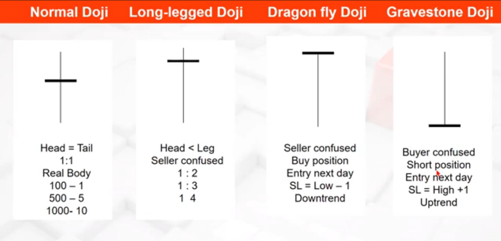
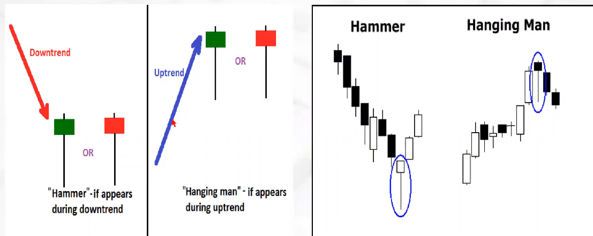
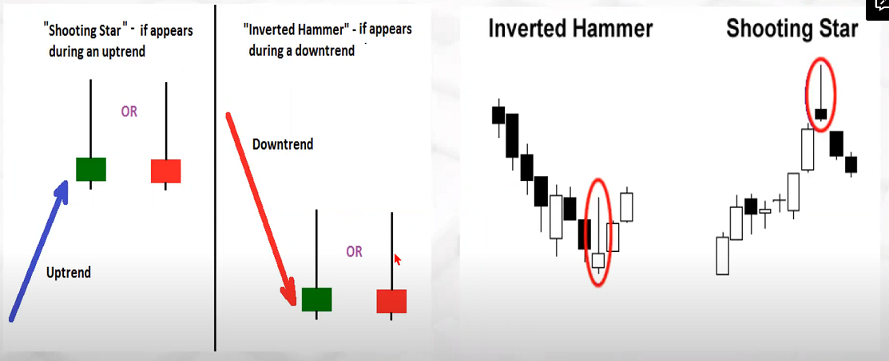
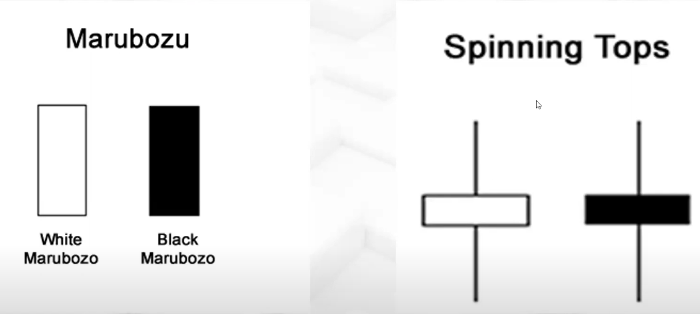
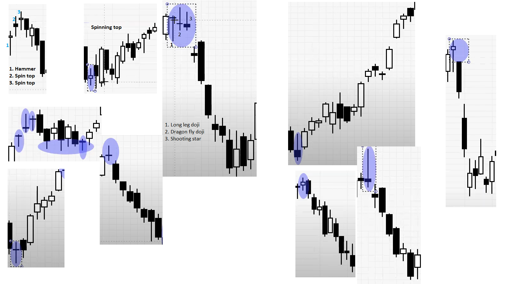

# Doji

Doji candle, the body is not just small, it’s almost negligible in size. The opening and closing prices are almost the same, or extremely close to each other. 

# Types of Entries as per trading style
    Aggresive
    Mild
    Safer

    How to use SL.
    Trailing Stop Loss has to be used.

    
# Hammer/ Hanging man v/s Inverted Hammer/ Shooting star

# Marubuzu & Spinning Top

* Red Marubuzu -> Strong Bearish
* Green marubuzu -> Strong Bullish

* Spinning Top -> Buyers and Sellers confused.

# Practical Application of Single Candlestick patters

* We will not trade on single candle.
* We will wait for confirmation.

