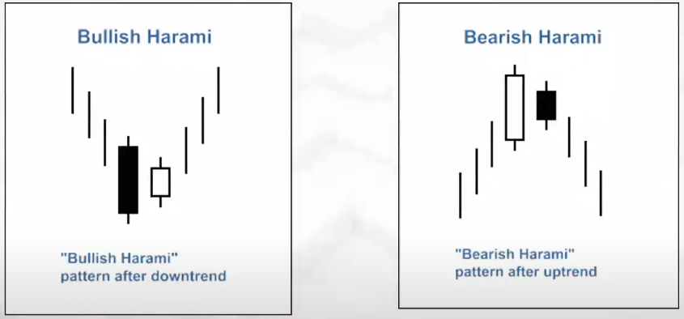
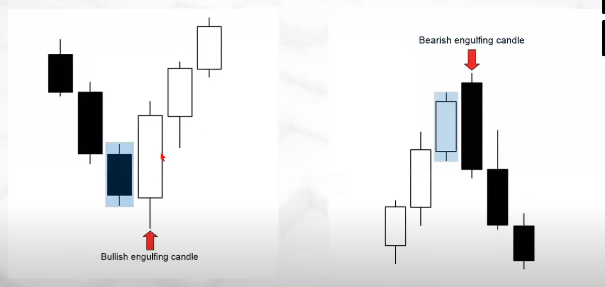
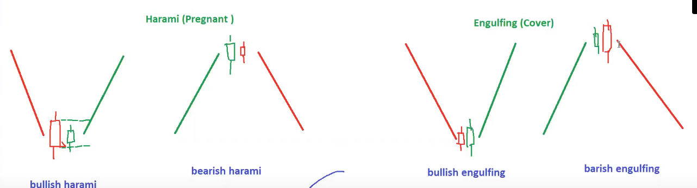
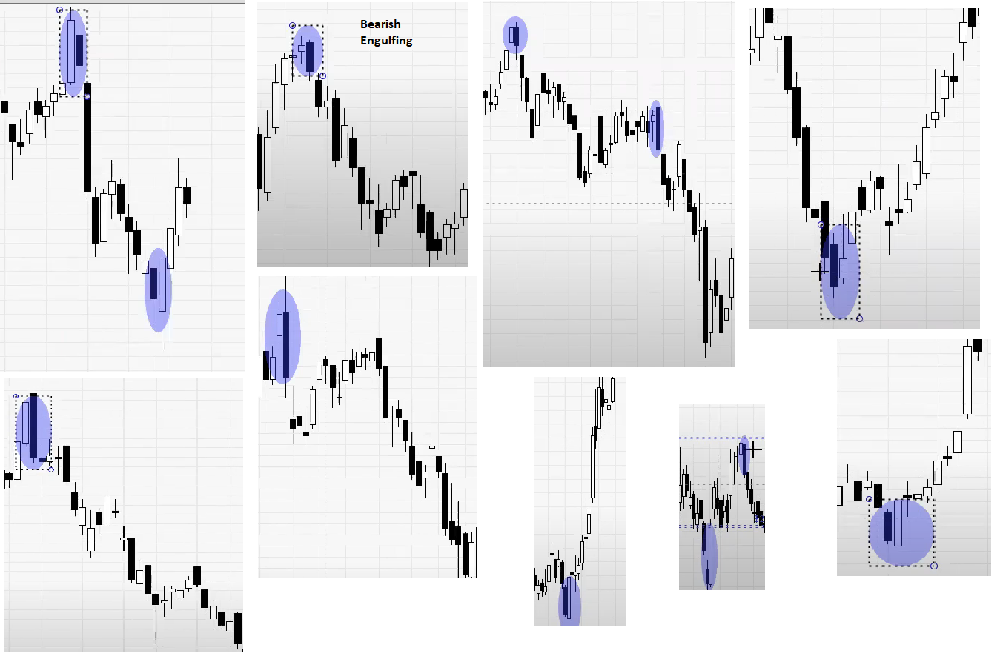
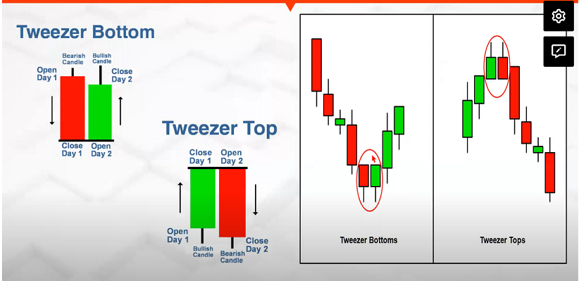
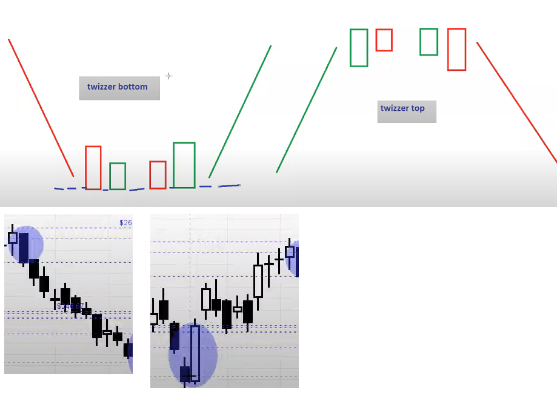

# Bullish Harami/ Bearish Harami/ Bullish Engulfing/ Bearish Engulfing





* In Engulfing pattern baby candle is covered by Mother candle. This pattern works superb & hence more preferable than Harami pattern.

```
For Bullish Harami / Bullish Engulfing

Entry = (H+L)/2
Range = H-L
T1 = E + R
T2 = T1 + R
SL = L - 1

For Beariesh Harami/ Bearish Engulfing

Entry = (H+L)/2
Range = H-L
T1 = E - R
T2 = T1 - R
SL = H + 1

```




# Practical application of Harami and Engulfing patterns



# Twizzer bottom and twizzer top





