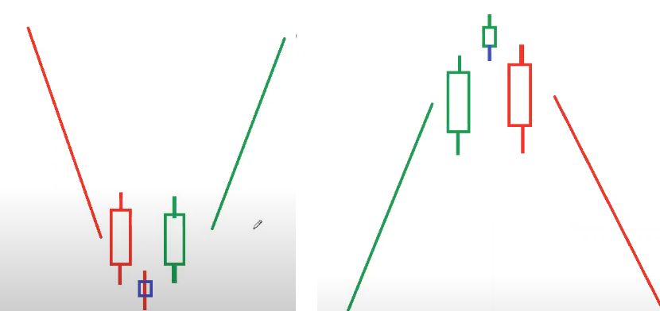
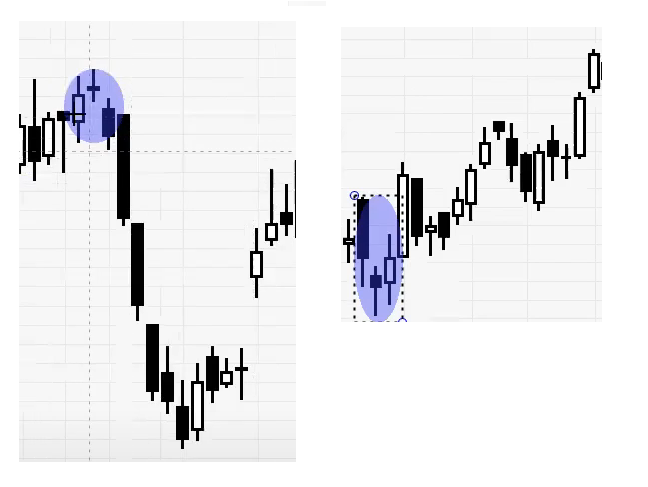

# Morning star/ Evening star




```
For Morning Star,
Entry = (HH + LL)/ 2
R = HH - RR
T1 = E + R
T2 = T1 + R
SL = LL - 1

For Evening Star,

Entry = (HH + LL)/ 2
R = HH - RR
T1 = E - R
T2 = T1 - R
SL = HH + 1

```

# Practical Application of Morning & Evening star


