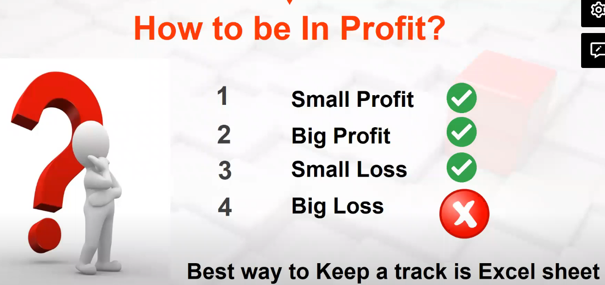
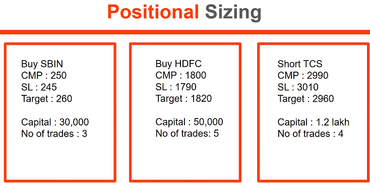
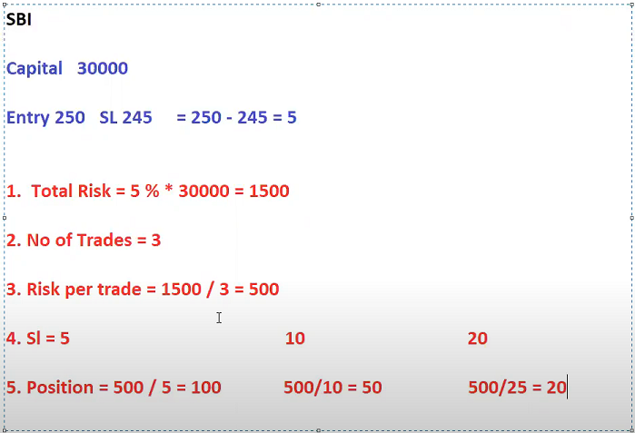
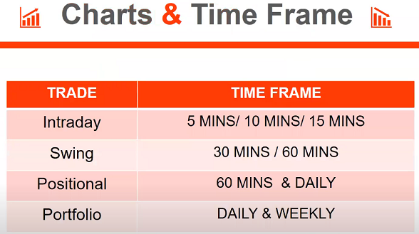

# Money management


* When to Trade ?
    Equity, Future & Options

    Start with Equity for 3 months, untill our strike becomes 70%
    After that start with Futures (Nifty, Bank Nifty)
    Later start with Option.

* What to Buy ?
    Fundamental Analysis

* When to buy and Sell ?
    Technical Analyis

* How much to buy ?
    Risk and Money Management
    
# Risk management





```
BUY HDFC

Capital = 50,000
Entry = 1,800
SL = 1,790
TA = 1,820

1. Total Risk = 5% * 50,000 = 2,500
2. No of trades = 5
3. Risk per trade = 2,500 / 5 = 500

4. SL               10                  20
5. Position         500/10=50           500/20=25
```

```
SHORT TCS

Capital = 1,20,000
Entry = 2,990
SL = 3,010
TA = 2,960

1. Total Risk = 5% *1,20,000 = 6000
2. No of trades = 4
3. Risk per trade = 6,000 / 4 = 1500

4. SL               20
5. Position         1500/20=75
```



Generally use 5mins before 11am, thereafter use 15mins candles during intraday.

Bigger the time frame, more the accuracy.

For Swing trade, use 30, 60, Daily
