# Ready Reckoner for a Professional Traders

* Every night plan about tommorow action.
* Check Singapore nifty
    - This starts at early morning 6.30 and gets traded late even after 3.30pm

    https://www.moneycontrol.com/markets/global-indices

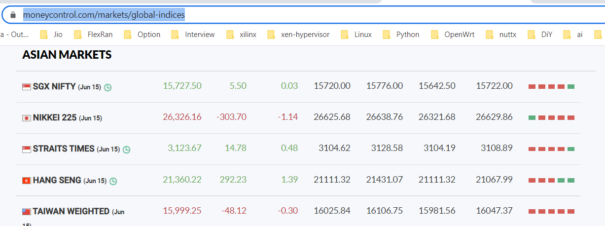

    Using SGX Nifty and our premarket we can decide the momentum  of the market i.e. the start candles.

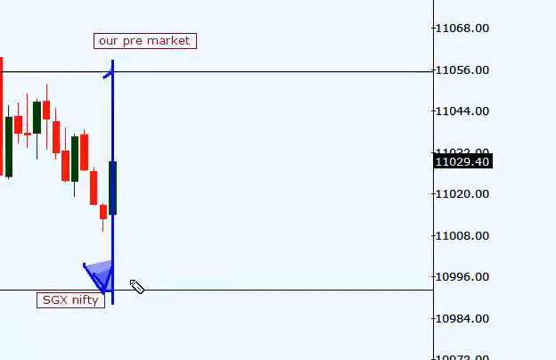

### Analysing pre market trend using nifty TOP 10 companies.

https://www1.nseindia.com/content/indices/ind_nifty50.pdf

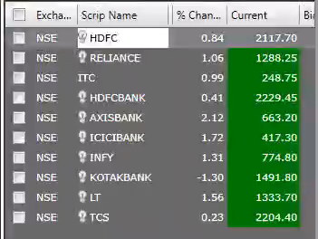

From above TOP 10 companies, try to bifurcate them into Upside, Downside, Sideways

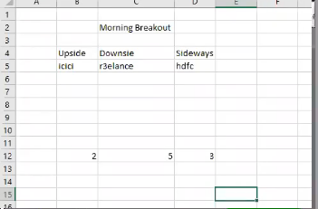

If most of the stocks of nifty is on downside then nifty is moving downside. this is how we decide trend.

Note : if we continue watching position it could affect our psychology and we can make wrong descision.

### Analysis of which sector is aligned with the market.

1. At 9.30 using all above items, we confirm that nifty is in downside.
    Now Open marketwatch -> load MW -> sectorial analysis

2. Draw support and resistances of sector and check wheather it is upside/ downside.

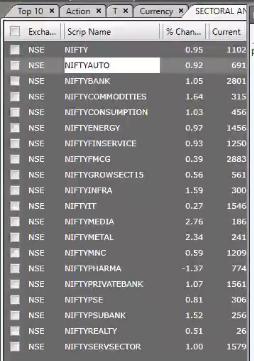

3. Suppose using 5 mins candle we saw that market is downside and 'Reality sector is aligned with nifty'. We should check reality stocks, and see which stock is more aligned with the sector chart.

Open MarketWatch -> NSE -> SectorialIndices -> NiftyReality

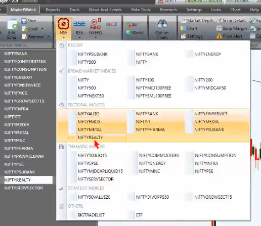

Now in below mw we can see GodrejProperties is aligning with Nifty, so we can trade there.

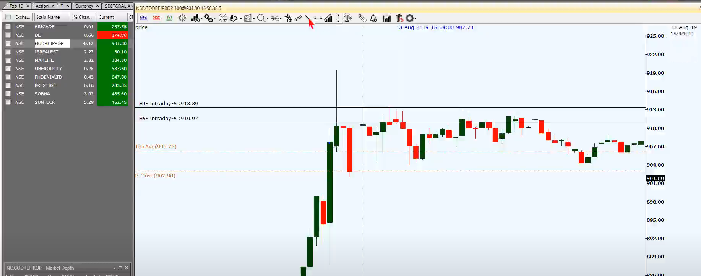

### SUMMARY

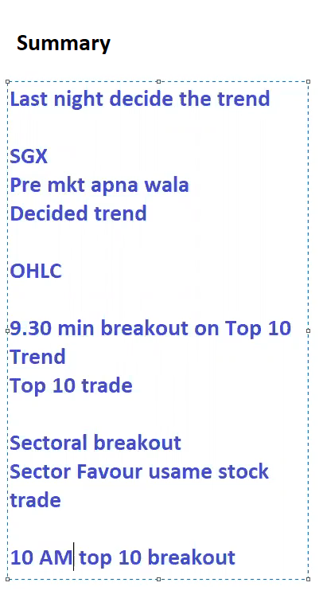

### Accuracy 
    To achieve accuracy trading setups has to be used.
    
Sample trading setups.
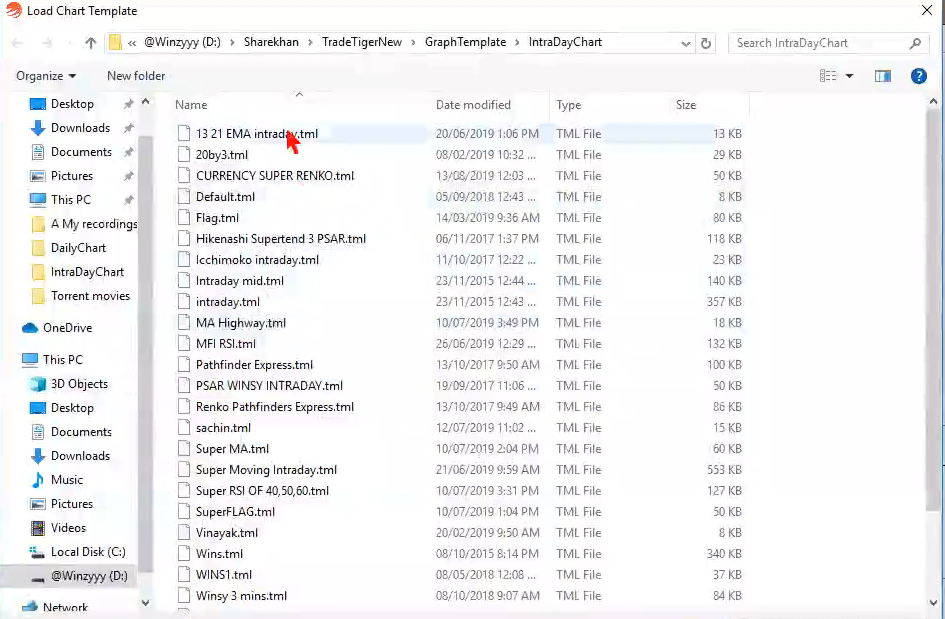

Super RSI of 40,50,60.
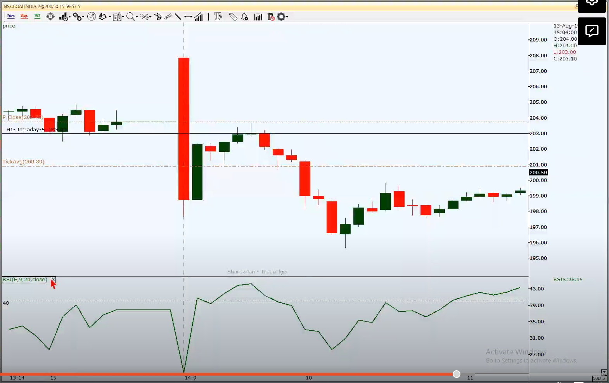

Flag.tml
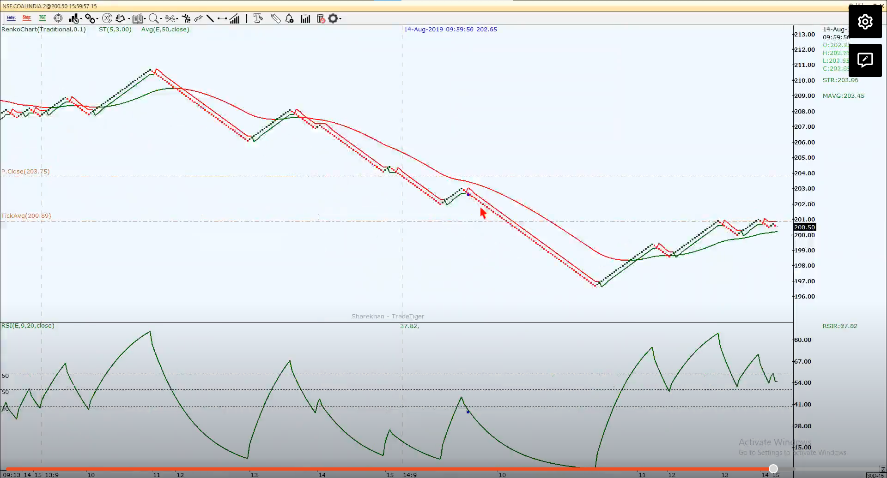