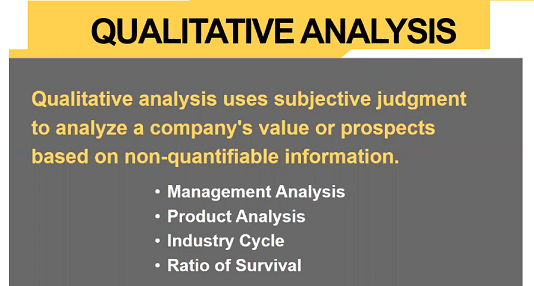
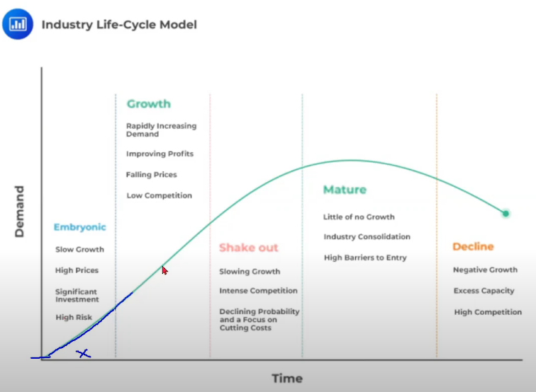
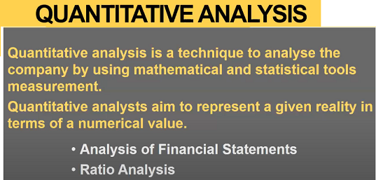

# Concept Introduction

Fundamental Analysis is art of evaluating the intrinsic value of a stock to find long term investment opportunities.
* Qualitative Analysis
* Quantative Analysis

# Qualatative Aspect of Value Investing

# Quantitative Aspect of Value Investing

