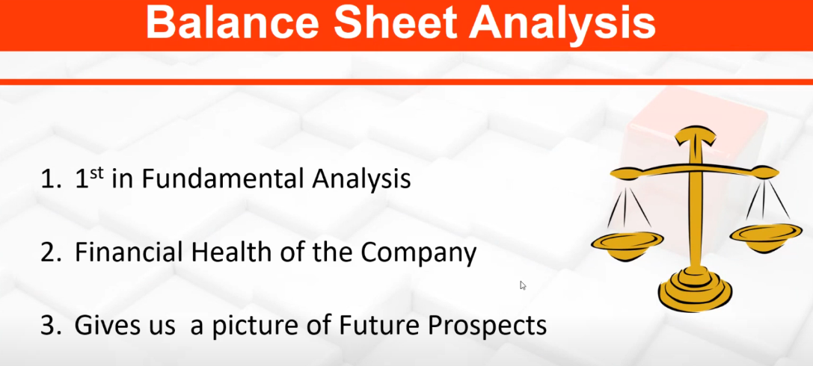

# Introduction to Financial Statements

# How and What to Analyse in P&L Account

## To check profit and Loss account.
    Goto moneycontrol.com -> Search Quote -> Goto Yearly Results.

Debt:Equity ratio should be less than 1.
From P/L Statement, check for Sales and PAT (P/L after Tax)
 
# Criteria to Analyse Good, Avg & Poor P&L Account

Good PL Statement

Average PL Statement

Poor PL Statement

# Balance Sheet Analysis/ Criteria to Analyse Good, Avg & Poor Balance Sheet

Company balance sheet should at least increase 15%. Because bank gives 8% interest.

# Practical Understanding of Good, Avg & Poor Company

