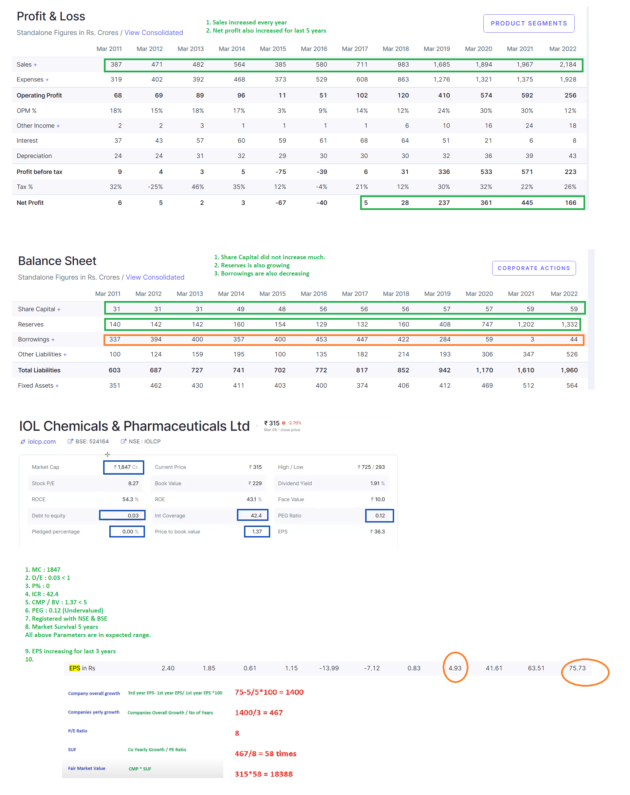
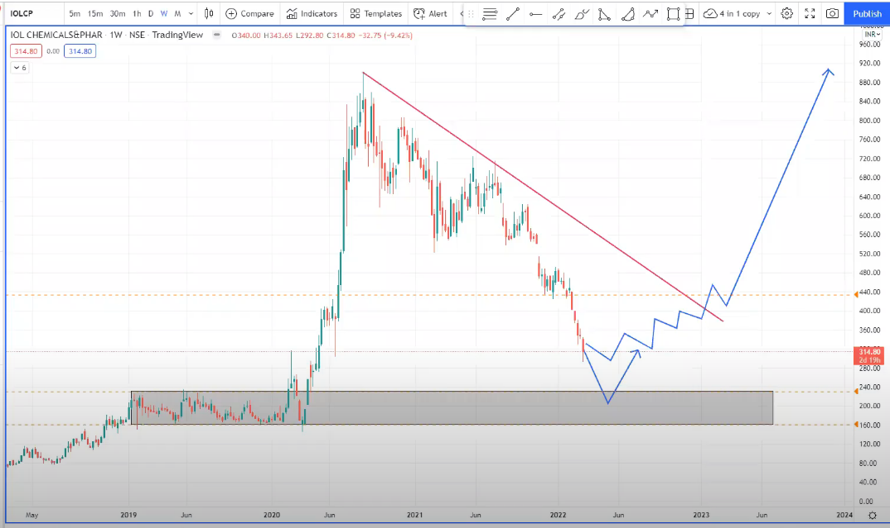

# Value Investing Full Revision 8th march 2022

P/L A/c :
* Increasing Sales
* Increasing Net Profit

Balance Sheet :
*    Share Capital should be same or decreasing
*    Increasing R&S (Reserves & Surplus)
*    Decreasing Debt (Loan/Borrowings)

# 10 Parameters for Fundamental Analysis.

1.  Market Capital > 100 Cr
2.  Debt : Equity Ratio < 1,
        For Financial Institutions, D:E Ratio < 5
3.  Pledge % = 0
4.  Current Market Price to Book Value (CMP to BV ) < 5
5.  Listed in NSE and BSE
6.  Intrest Coverage Ratio, i.e. ICR > 3 ( Minimum 3 Years )
7.  Price Earning to Growth Ratio, PEG Ratio  (0 < PEG < 1)

        As a general rule, a PEG ratio of 1.0 or lower suggests a stock is fairly priced or even undervalued. A PEG ratio above 1.0 suggests a stock is overvalued.

8.  Survival of company in market > 5 (Minimum 5 years )
9.  Earning per share i.e. EPS should increase (for 3 years)
10. Company must be undervalued * minimum 3 times.

# Case Studies

## IOL Chemicals & Pharmaceuticals Ltd

 

 
