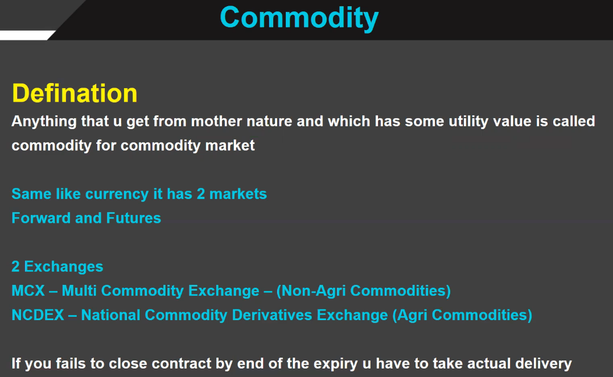
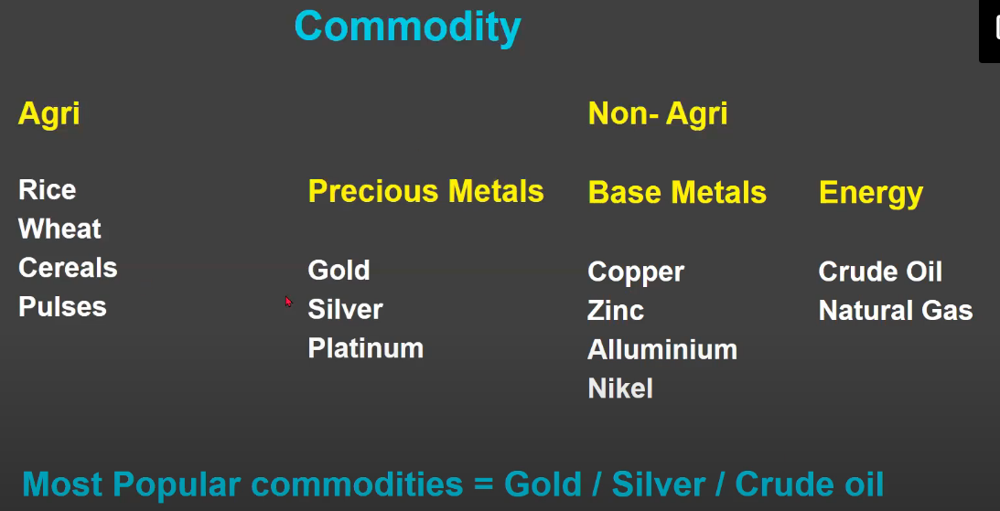
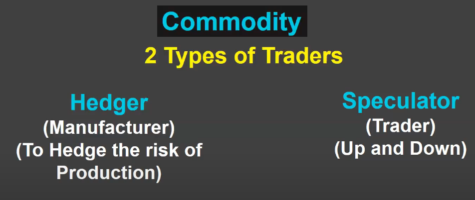
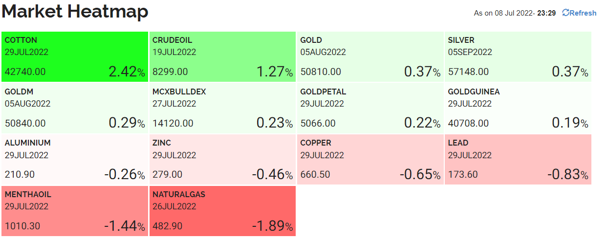
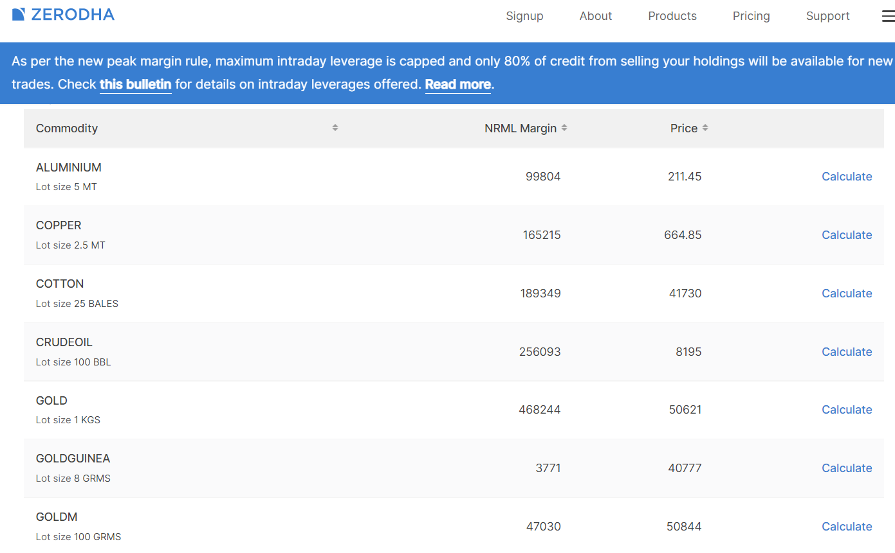
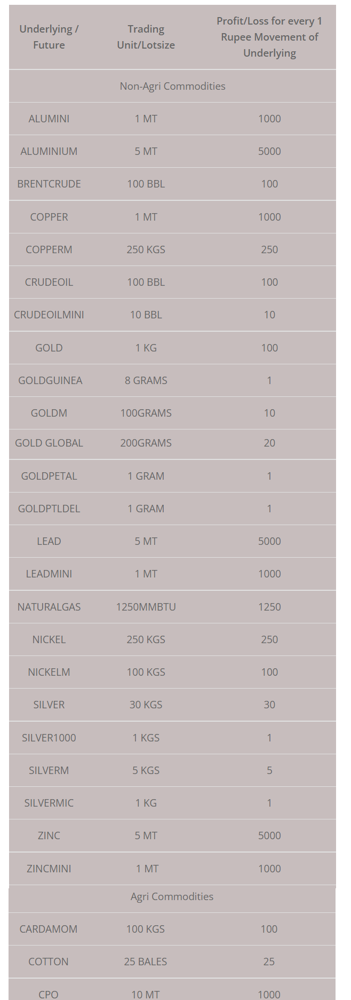
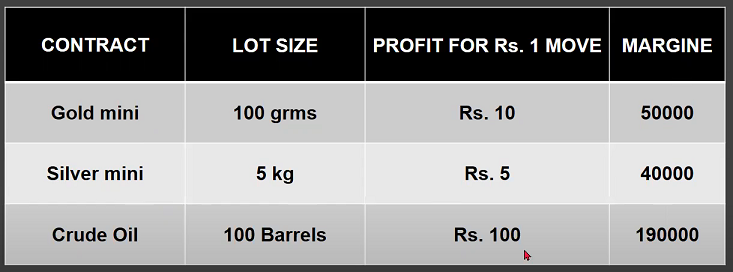

# Commodity Basics
 

# Types of Commodities
 

* Agri is traded in Forward Markets.
* Non argi is traded on Exchange.

# Types of Commodity Traders

 

# Commodity Contracts & Profit Calculation

https://www.mcxindia.com/market-data/heatmap

 

 

## mcx-profitloss-for-every-1-rs-change

 

 