# 1. Derivative Market Overview

 

    In Futures market, we get margin.
    Forward markets are actual market.
    In Option market, premium is required.
    In Swaps, assests are swapped between parties.

# 2. Understanding of Option Contrat
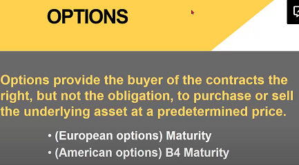 

# 3. Call, Put, Holder, Writer
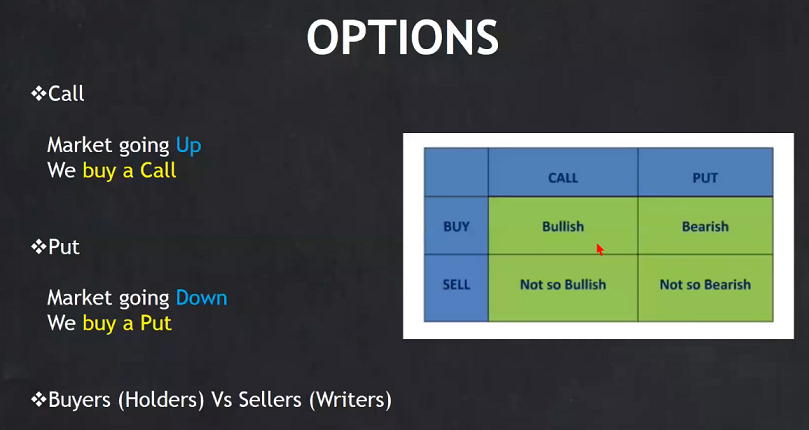 

# 4. Strike Price - ITM, ATM & OTM

CALL/PUT STRIKE PRICE

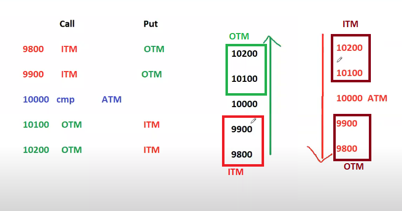 

# 5. OPTION PRICING - PREMIUM, INTRINSIC & TIME VALUE

    If Expiry,
    30 days : OTM (As OTM is cheaper and price can travel till there as it has 30 days)
    20 days : ATM and Near ITM, OTM
    Last 10 days : Only ITM (Not much time left for price to travel to OTM)

    INTRINSIC_VALUE = Diff in 2 STRIKE PRICE.
    TIME_VALUE = PREMIUM - INTRINSIC_VALUE

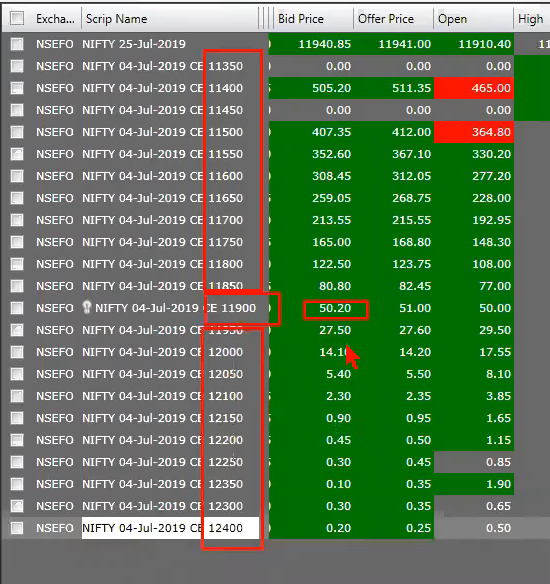 

 In above snap, 
* ATM = 11900
* ITM = Below 11900 (i.e. 11850, 11800, ...)
* OTM = Above 11900 (i.e. 11950, 12000, ...)

If CMP increases OTM will increase, and if CMP decreases OTM will decrese and become 0.

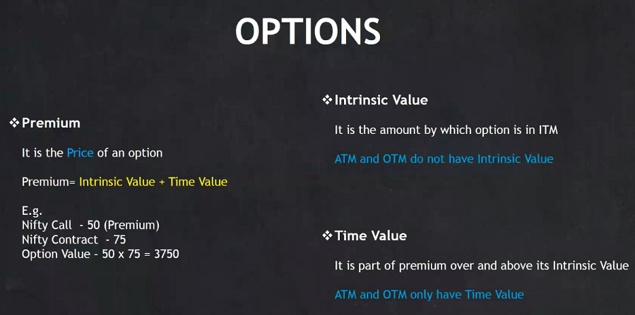

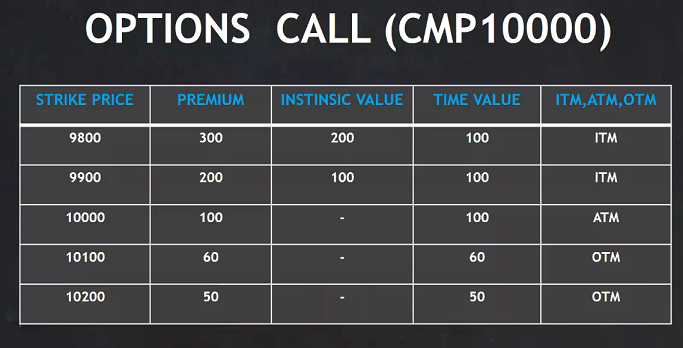

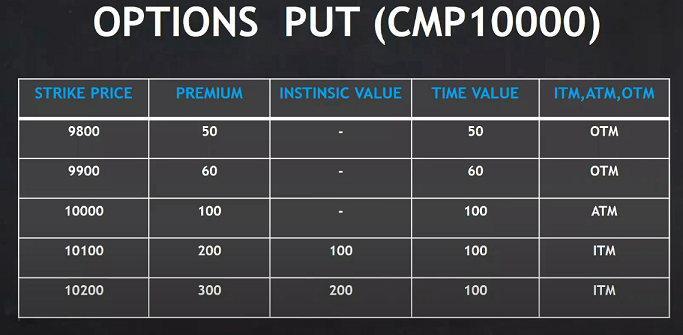

# 6. ANALYSIS OF OPTION CHAIN

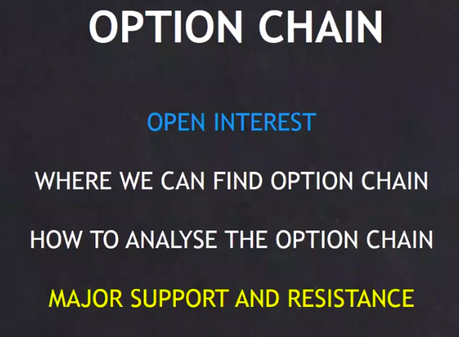

## Option chain Analysis.
    Go to nseindia.com -> live market -> option chain -> equity derivative.

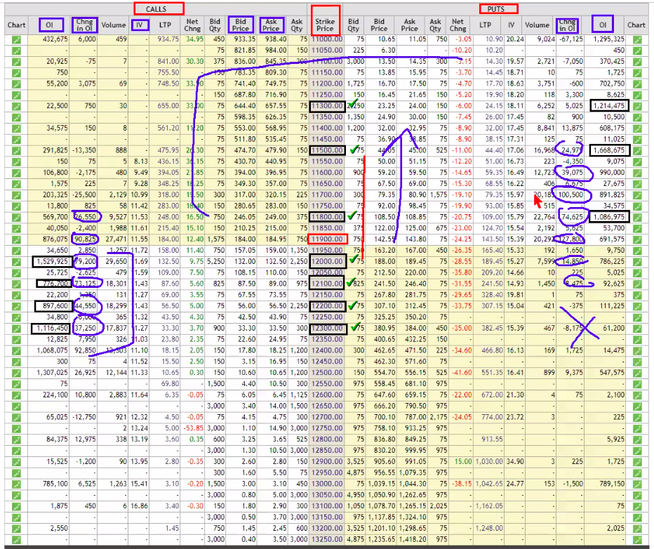

    On Call side,
    For monthly views, we will focus on OTM values (i.e white portion). 
    Search for highest OI. (15 Lacs, 11 Lacs, 8 Lacs, 7 Lacs)
    We will mark SP, as it is containing maximum OI.

    On Put Side,
    Highes OI, 16 Lacs, 12 Lacs, 10 Lacs.

    For CMP 11900, 12000 is the strongest resistance from  as it has many contracts.
    Higest support is at 11800, 11500.
    
    Since bigger contracts are on 12000 & 11500 so price may fluctutate in between.

# 7. OPTIONS ARE RISKY - Why and How ??

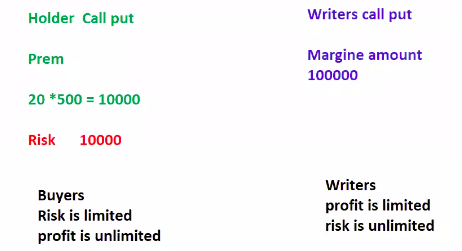

    For Holders,
    Suppose Premium is 20 Rs and it goes upto 100, 200, 300 .....
    Then,
        20 -> 100 : 80 Increase : Profit of 80*500=40,000/-
        20 -> 200 : 180 Inc : Profit 0f 190*500=90,000/-
    Hence for Holders, Risk is limited & Profit is unlimited.

    For Writers,
    Suppose premium is 20 Rs and it goes down to 0.
    Then, 20 -> 0, Decrease by 20, Profit : 20*500=10,000/-
    
    If, 20 -> 100 : 80 Increase : Loss of 80*500=40,000/-
    Here risk is unlimited & Profit is limited.

----
    BUT WRITERS EARN, BECAUSE MAXIMUM CONTRACTS AT TIME OF EXPIRY, TIME VALUE BECOMES 0.

    Suppose CMP is 9900,
    And as per my view I purchased 10000 call at Premium 50 (20 days before expiry).

    But after 10 days CMP is still 9900,
    My Premium is decreased to 30 Rs, because Premium is only Time value and it get reduced as expiry approaches.

---

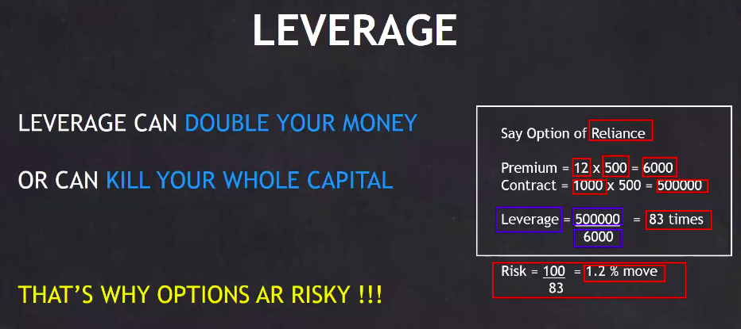

---
Practise,

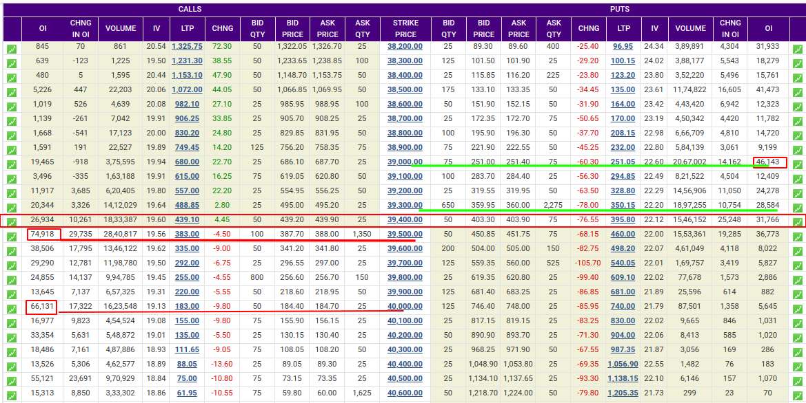

