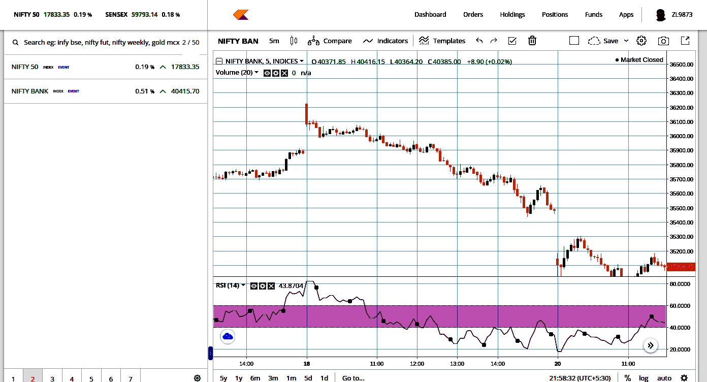

# 1. Expiry Super Jackpot Day ( Gap up but U trade)

https://web.sensibull.com/option-chain?expiry=2022-09-15&tradingsymbol=BANKNIFTY

----

# 2. Gap Down - Still Trending Trade

    Intraday, Short, 
    Bank Nifty 35200 call @ 370
    SL 420
    Target as per comformt
    Start Small

# 3. Trending Day

    Pre market Level marking.

Morning Buy moves (Gap up Opening), but did not work.

### Zerodha Studies used by instructor. 

# 4. Rangebound Volatile day

Indicators are not God.

