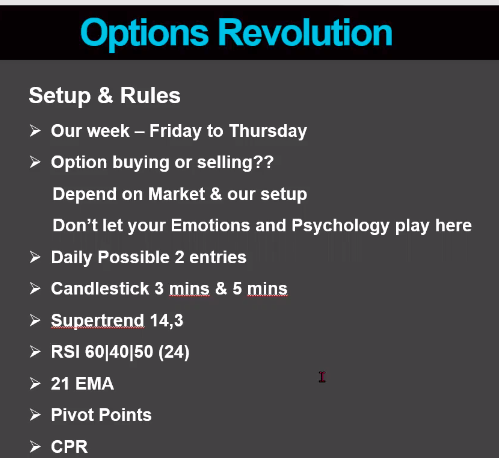

# The Whole summary of Option Revolution

    QNA:

    ENTRY (Buying Vs Selling)
    
    Buying - (Whenever Momentum iS good)
        On Trending Buy CE, Down Trend Buy PE.
    1.  Supertrend
    2.  Touch and Up or Down EMA.
    3.  RSI above 60, RSI below 40.

    Selling - 
        RSI (50-60) - Short PE
        RSI (50-40) - Short CE
